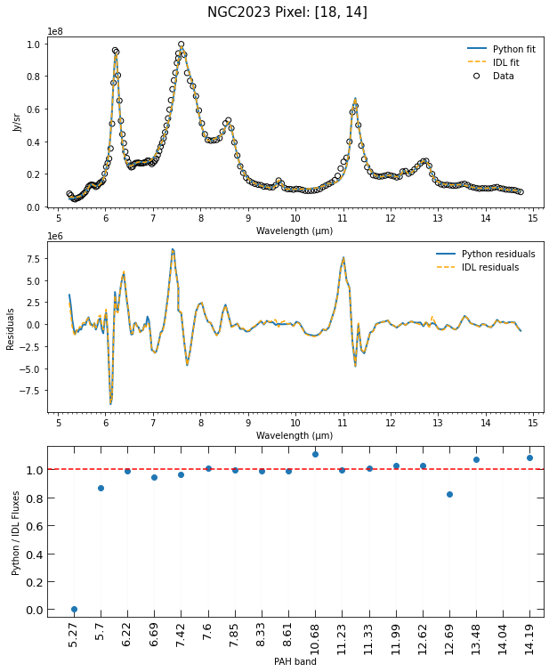

###############################
IDL vs. Python Spectrum Fitting
###############################

Fit Results
===========

The surface brightness data in the following spectra are from a southern region of 
NGC 2023. To learn more about the region of NGC 2023 examined, refer to *The PAH 
Emission Characteristics of the Reflection Nebula NGC 2023* by Els Peeters et al.

Changes to Default scipack File Used for Fitting
================================================

Several changes were made to the default package *scipack_ExGal_SpitzerIRSSLLL.ipac*
when fitting the infrared spectrum of NGC 2023.  Of note, the **amp** values of 
H2 S(4), H2 S(6) and H2 S(7) were changed to **0**.  Additionally, the **amp_fixed** 
values of the same features were changed to **True**.

Python vs. IDL PAHFIT Results
=============================

The graphs below compare the fit results of given pixels of NGC 2023.  The top graph
shows the Python and IDL spectrum fit along with the data points used.  The second
graph shows the residuals resulting from the fits.  Lastly, the third graph compares
the calculated fluxes of PAH features obtained from the fits.  In both graphs, the 
resulting fit came from default maxiter values (the IDL version of PAHFIT uses a 
default maxiter of 200 while the Python version uses a default maxiter of 1000).

The above graphs of pixel [18, 14] represent a 'good' comparison between the IDL
and Python fit.  That is, the fits resulted in similar residuals and calculated 
fluxes.  Of note, the Python fit does not contain a dust feature at 5.27 µm
while the IDL fit does. Additionally, both the Python and IDL fit do not contain a 
dust feature at 14.04 µm.

Contrastingly, the graphs of pixel [37, 21] represent more dissimilar IDL and
Python fits.  Interestingly, in this case, the Python fit did not contain dust
features for 5.27 and 5.70 µm.  Conversely, while it did contain the 5.70 µm feature,
the IDL fit did not contain the 10.68 µm dust feature.

In general, for NGC 2023, spectrum fitting seemed to be the least accurate below 
6 µm and above 14 µm. Further, the spectrum fit around 11 µm does not always 
appear accurate. In fact, the accuracy of the fit tends to decease as the 
11.0 µm PAH feature increases.
