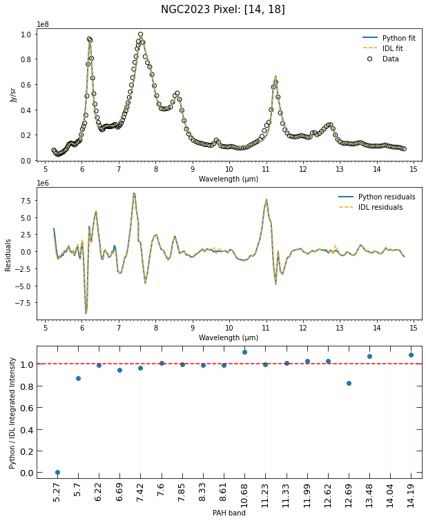
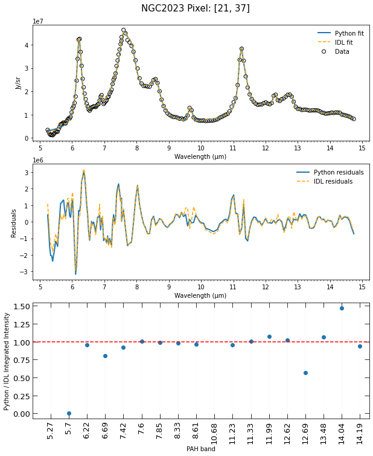

###############################
IDL vs. Python Spectrum Fitting
###############################

Background Information
======================

The surface brightness data in the following spectra are from a southern region of 
NGC 2023. To learn more about the region of NGC 2023 examined, refer to *The PAH 
Emission Characteristics of the Reflection Nebula NGC 2023* by Els Peeters et al.
(found in The Astrophysical Journal, Volume 836, Issue 2, article id. 198, 40 pp. 
(2017) or found in the ADS at https://ui.adsabs.harvard.edu/abs/2017ApJ...836..198P/abstract)

.. note::
   Several changes were made to the default package *scipack_ExGal_SpitzerIRSSLLL.ipac*
   when fitting the infrared spectrum of NGC 2023.  Of note, the **amp** values of 
   H2 S(4), H2 S(6) and H2 S(7) were changed to **0**.  Additionally, the **amp_fixed** 
   values of the same features were changed to **True**.

Python vs. IDL PAHFIT Results
=============================

The graphs below compare the fit results of given pixels of NGC 2023.  The top graph
shows the Python and IDL spectrum fit along with the data points used.  The second
graph shows the residuals resulting from the fits.  Lastly, the third graph compares
the calculated integrated intensities of PAH features obtained from the fits.  In both 
graphs, the resulting fit came from default maxiter values (the IDL version of PAHFIT 
uses a default maxiter of 200 while the Python version uses a default maxiter of 1000).

The above graphs of pixel [14, 18] represent a 'good' comparison between the IDL
and Python fit.  That is, the fits resulted in similar residuals and integrated 
intensities.  Of note, the output of the Python version of PAHFIT fit did not contain
a dust feature at 5.27 µm (DF0 **amp** = 0) while the IDL fit did. Additionally, 
both the Python and IDL PAHFIT outputs did not contain a dust feature at 14.04 µm.

Contrastingly, the graphs of pixel [21, 37] represent more dissimilar IDL and
Python fits.  Interestingly, in this case, the Python PAHFIT output did not contain 
dust features for 5.27 and 5.70 µm.  Conversely, while it did contain the 5.70 µm 
feature, the IDL PAHFIT output did not contain the 10.68 µm dust feature.

In general, for NGC 2023, Python spectrum fitting seemed to be the least accurate 
below 6 µm and above 14 µm. Further, in both Python and IDL, the spectrum fit 
around 11 µm does not always appear accurate. In fact, the accuracy of the fit tends 
to decrease as the 11.0 µm PAH feature increases.
