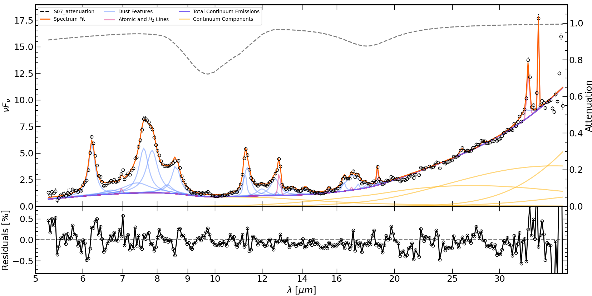

####################
Plotting fit results
####################

Plotting
========

The saved results from a PAHFIT run can be plotted using the ``plot_pahfit``
script.  By default, the plot is displayed.  To save the plot instead,
use the `--savefig` command line option.

.. code-block:: console

  $ plot_pahfit M101_Nucleus_irs.ipac M101_Nucleus_irs_output.ipac

The first argument gives the file with the observed spectrum.
The second argument gives the file with the output of the ``run_pahfit``
script.

Help for the possible command line options for the ``plot_pahfit`` script
can be seen by:

.. code-block:: console

  $ plot_pahfit --help

Example Plot
============

The default output figure is shown below. The top panel displays the
observed spectrum as open circles; the full PAHFIT model, the dust and stellar continua, and
the sum of the continua as solid lines (see the legend for the
color coding); the dust features as blue
lines; and the atomic features as purple lines.  The attenuation is
shown as a dashed line at the top.  The bottom panel displays the
residuals.

