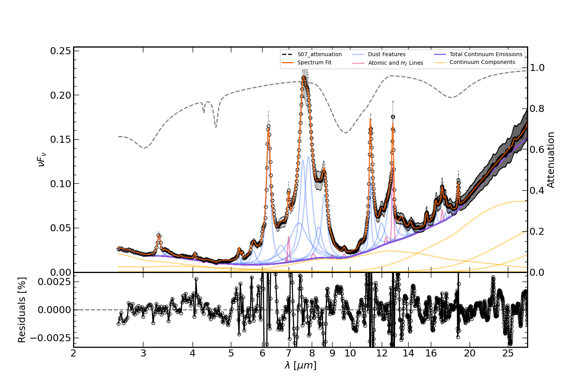

########################
PAHFIT v2.1 (2.5--38 µm)
########################

.. _summary_PAHFITv21:

Summary of the additional features including in PAHFIT v2.1
"""""""""""""""""""""""""""""""""""""""""""""""""""""""""""

Details can be found in `Lai et al. 2020, ApJ, 905, 55 <https://iopscience.iop.org/article/10.3847/1538-4357/abc002/pdf>`_.

Dust features:
--------------

+------------+------------------+
| Name       | Wavelength (µm)  |
+============+==================+
| PAH 3.3    | 3.29             |
+------------+------------------+
| Aliphatic  | 3.40             |
+------------+------------------+
| plateau    | 3.47             |
+------------+------------------+
| PAH 5.24   | 5.24             |
+------------+------------------+
| PAH 5.33   | 5.33             |
+------------+------------------+

Line features:
--------------

+------------+------------------+
| Name       | Wavelength (µm)  |
+============+==================+
| Br beta    | 2.63             |
+------------+------------------+
| Pf gamma   | 3.74             |
+------------+------------------+
| Br alpha   | 4.05             |
+------------+------------------+
| Pf beta    | 4.65             |
+------------+------------------+

Absorption features:
--------------------

+------------+------------------+
| Name       | Wavelength (µm)  |
+============+==================+
| H2O        | 3.05             |
+------------+------------------+
| CO2        | 4.27             |
+------------+------------------+
| CO         | 4.67             |
+------------+------------------+
| H2O        | 6.02             |
+------------+------------------+

Fitting and plotting the AKARI+Spitzer spectrum
"""""""""""""""""""""""""""""""""""""""""""""""
The example here is based on the 1C spectrum, produced by averaging spectra of 60 PAH bright galaxies, in `Lai et al. 2020, ApJ, 905, 55 <https://iopscience.iop.org/article/10.3847/1538-4357/abc002/pdf>`_.

To run the fit and output the plot, simply type:

.. code-block:: console

  $ run_pahfit Lai2020_1C_akari_spitzer.ecsv scipack_ExGal_AkariIRC+SpitzerIRSSLLL.ipac 

.. code-block:: console

  $ plot_pahfit Lai2020_1C_akari_spitzer.ecsv Lai2020_1C_akari_spitzer_output.ipac

Below shows the image output. The description of the output plot is similar to that in the `Example Plot <https://github.com/PAHFIT/pahfit/blob/master/docs/plot_result.rst>`_, but with an additional spectral coverage down to 2.5 micron. 

